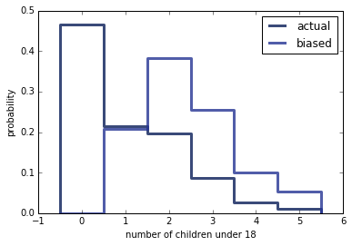

[Think Stats Chapter 3 Exercise 1](http://greenteapress.com/thinkstats2/html/thinkstats2004.html#toc31) (actual vs. biased)

>```python
import thinkstats2
import chap01soln
import thinkplot
```


>```python
resp = chap01soln.ReadFemResp()
pmf = thinkstats2.Pmf(resp['numkdhh'],label='actual')
```


>```python
def BiasPmf(pmf, label=''):
    """Returns the Pmf with oversampling proportional to value.

    If pmf is the distribution of true values, the result is the
    distribution that would be seen if values are oversampled in
    proportion to their values; for example, if you ask students
    how big their classes are, large classes are oversampled in
    proportion to their size.

    Args:
      pmf: Pmf object.
      label: string label for the new Pmf.

     Returns:
       Pmf object
    """
    new_pmf = pmf.Copy(label=label)

    for x, p in pmf.Items():
        new_pmf.Mult(x, x)
        
    new_pmf.Normalize()
    return new_pmf
```


>```python
bpmf = BiasPmf(pmf,label='biased')
```


>```python
print 'The actual mean number of children is:   ',pmf.Mean()
```

>    The actual mean number of children is:    1.02420515504


>```python
print 'The biased mean number of children is:   ',bpmf.Mean()
```

>    The biased mean number of children is:    2.40367910066


>```python
% matplotlib inline
thinkplot.Pmfs([pmf,bpmf])
thinkplot.Show(xlabel='number of children under 18',ylabel='probability')
```



