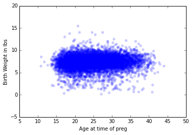
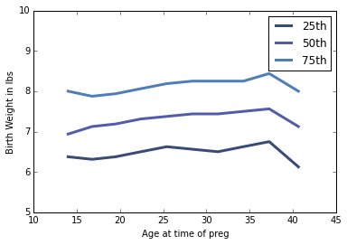

[Think Stats Chapter 7 Exercise 1](http://greenteapress.com/thinkstats2/html/thinkstats2008.html#toc70) (weight vs. age)

```python
import nsfg
import thinkstats2
import thinkplot
import numpy as np
%matplotlib inline
```


```python
preg = nsfg.ReadFemPreg()
```


```python
thinkplot.Scatter(preg.agepreg,preg.totalwgt_lb)
thinkplot.Show(xlabel='Age at time of preg',ylabel='Birth Weight in lbs')
```




```python
bins = np.arange(15,42,3)
indices = np.digitize(preg.agepreg,bins)
groups = preg.groupby(indices)
```


```python
for i, group in groups:
    print (i, len(group))
```

    (0, 159)
    (1, 1308)
    (2, 2642)
    (3, 2544)
    (4, 2183)
    (5, 1770)
    (6, 1341)
    (7, 765)
    (8, 376)
    (9, 505)


```python
ages = [group.agepreg.mean() for i,group in groups]
cdfs = [thinkstats2.Cdf(group.totalwgt_lb) for i,group in groups]
```


```python
for percent in [25,50,75]:
    weights = [cdf.Percentile(percent) for cdf in cdfs]
    label = '%dth' % percent
    thinkplot.Plot(ages, weights, label=label)
thinkplot.Show(xlabel='Age at time of preg',ylabel='Birth Weight in lbs',axis = [10,45,5,10])
```




```python
preg = preg.dropna(subset = ['agepreg','totalwgt_lb'])
print "Pearson's Correlation Coefficient: %g" % thinkstats2.Corr(preg.agepreg,preg.totalwgt_lb)
```

    Pearson's Correlation Coefficient: 0.068834


```python
print "Spearman's Rank Correlation: %g" % thinkstats2.SpearmanCorr(preg.agepreg,preg.totalwgt_lb)
```

    Spearman's Rank Correlation: 0.09461


I think there might be a very slight positive relationship between age of the mother and birth weight of the baby. However, if there is a correlation, it is likely very weak.
