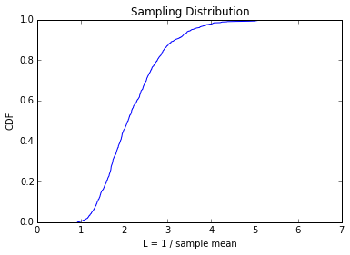
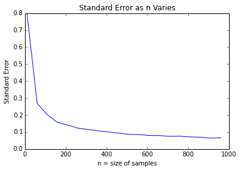

[Think Stats Chapter 8 Exercise 2](http://greenteapress.com/thinkstats2/html/thinkstats2009.html#toc77) (scoring)

```python
import random
```

```python
n = 10
lamb = 2
iters = 1000
Ls = []
for i in range(iters):
    sample = [random.expovariate(lamb) for _ in range(n)]
    Ls.append(float(n)/sum(sample))
```

```python
import numpy as np
```

```python
x = sorted(Ls)
y = np.arange(len(x))/float(len(x))
```

```python
import matplotlib.pyplot as plt
%matplotlib inline
```

```python
plt.plot(x,y)
plt.xlabel('L = 1 / sample mean')
plt.ylabel('CDF')
plt.title('Sampling Distribution')
plt.show
```





```python
Ls_mean = sum(Ls)/float(len(Ls))
```

```python
print 'Standard Error of Estimator: <%g>' % ((1/float(len(Ls)) * sum((i-lamb)**2 for i in Ls))**.5,)
```

    Standard Error of Estimator: <0.763052>


```python
print '90 Percent Confidence Interval: <%g - %g>' % (x[int(.05*len(x))],x[int(.95*len(x))])
```

    90 Percent Confidence Interval: <1.25966 - 3.54827>


```python
n = np.arange(10,1000,50)
std_errors = []
for i in n:
    Ls = []
    for j in range(iters):
        sample = [random.expovariate(lamb) for _ in range(i)]
        Ls.append(float(i)/sum(sample))
    std_error = (1/float(iters) * sum((k-lamb)**2 for k in Ls))**.5
    std_errors.append(std_error)
```

```python
plt.plot(n,std_errors)
plt.xlabel('n = size of samples')
plt.ylabel('Standard Error')
plt.title('Standard Error as n Varies')
plt.show
```


