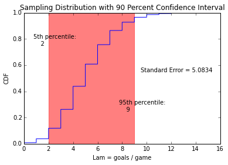

[Think Stats Chapter 8 Exercise 3](http://greenteapress.com/thinkstats2/html/thinkstats2009.html#toc77)


```python
import random
```

```python
def rate_to_goals(lam):
    t = 0
    time_of_game = 1
    goals = 0
    while t<time_of_game:
        t += random.expovariate(lam)
        if t<time_of_game:
            goals += 1
    return goals
```

```python
def MeanError(estimates, actual):
    errors = [estimate-actual for estimate in estimates]
    return float(sum(errors))/len(errors)
```

```python
def RMSE(estimates, actual):
    errors_squared = [(estimate-actual)**2 for estimate in estimates]
    return float(sum(errors_squared))/len(errors_squared)
```

```python
def simulate_games(n,lam):
    estimates = []
    for i in range(n):
        estimates.append(rate_to_goals(lam))
    print 'Mean Error of estimate = %g' % MeanError(estimates,lam)
    print 'RMSE/Standard Error of estimate = %g' % RMSE(estimates,lam)
    return estimates
```

```python
lam = 5
iters = 10000
estimates = simulate_games(iters,lam)
```

    Mean Error of estimate = 0.0394
    RMSE/Standard Error of estimate = 5.0834


Based on Mean Error, estimator is unbiased.


```python
import numpy as np
```

```python
x = sorted(estimates)
y = np.arange(len(x))/float(len(x))
```

```python
import matplotlib.pyplot as plt
%matplotlib inline
```

```python
plt.plot(x,y)
plt.xlabel('Lam = goals / game')
plt.ylabel('CDF')
plt.title('Sampling Distribution with 90 Percent Confidence Interval')
plt.axvspan(x[int(.05*len(x))], x[int(.95*len(x))], alpha=0.5, color='red')
plt.text(x[int(.05*len(x))]-1.25, .75, '5th percentile:\n    %g' % x[int(.05*len(x))])
plt.text(x[int(.95*len(x))]-1.25, .25, '95th percentile:\n    %g' % x[int(.95*len(x))])
plt.text(9.5,.55,'Standard Error = %g' % (RMSE(estimates,lam),))
plt.show
```





```python
lam = np.arange(5,45,5)
std_errors = []
for i in lam:
    estimates = simulate_games(iters,i)
    std_errors.append(RMSE(estimates,i))
```

    Mean Error of estimate = 0.0084
    RMSE/Standard Error of estimate = 4.9984
    Mean Error of estimate = -0.0229
    RMSE/Standard Error of estimate = 10.1045
    Mean Error of estimate = -0.0078
    RMSE/Standard Error of estimate = 14.9994
    Mean Error of estimate = -0.0116
    RMSE/Standard Error of estimate = 20.0562
    Mean Error of estimate = -0.0045
    RMSE/Standard Error of estimate = 24.7925
    Mean Error of estimate = -0.1143
    RMSE/Standard Error of estimate = 29.9733
    Mean Error of estimate = 0.064
    RMSE/Standard Error of estimate = 35.1872
    Mean Error of estimate = 0.0157
    RMSE/Standard Error of estimate = 40.0005


```python
plt.plot(lam,std_errors)
plt.xlabel('Lam = goals / game')
plt.ylabel('Standard Error of Estimator')
plt.title('Standard Error of Estimator for increasing true Lam')
```


